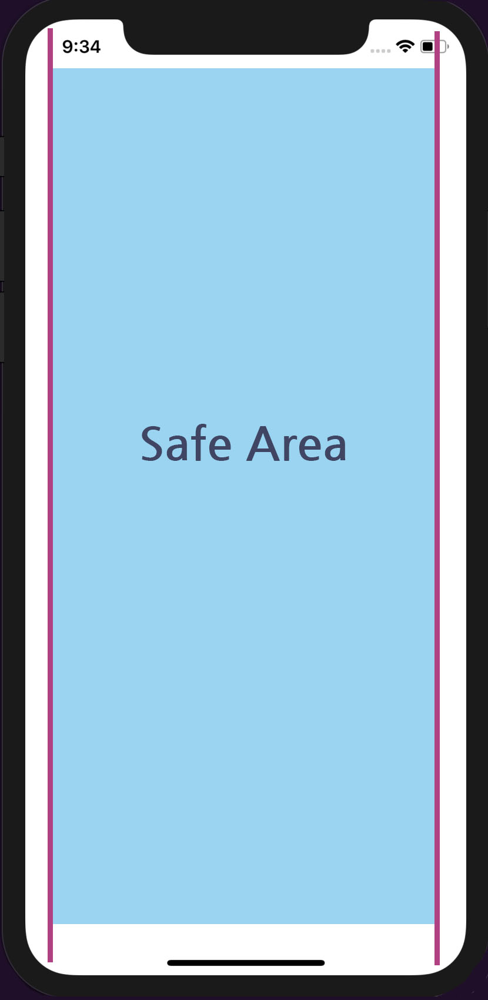
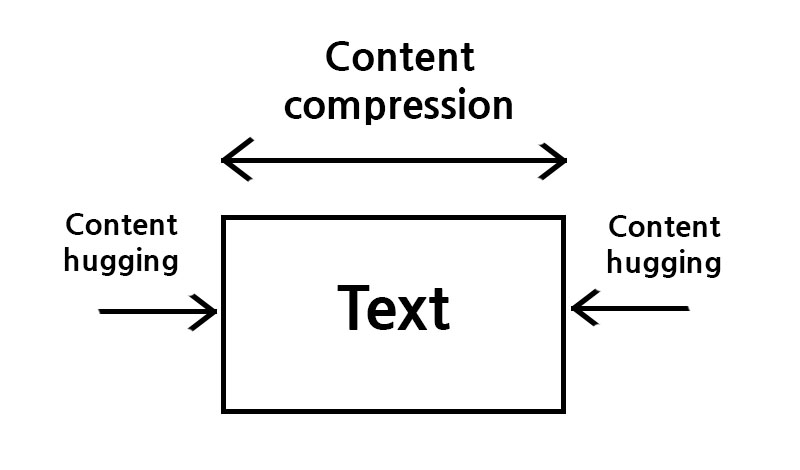

# 오토레이아웃

뷰의 제약 사항을 바탕으로 뷰 체계 내의 모든 뷰의 크기와 위치를 동적으로 계산해 애플리케이션을 사용할 때 발생하는 외부, 내부 변경에 동적으로 반응하는 사용자 인터페이스를 가능하게 한다.


### 외부 변경(External Changes)

슈퍼뷰의 크기나 모양이 변경될 때 발생한다. 각각의 변화와 함께, 사용 가능한 공간을 가장 잘 사용할 수 있도록 뷰 체계의 레이아웃을 업데이트해줘야 한다.

**외부 변경이 발생하는 경우**

- 사용자가 아이패드의 분할뷰(Split View)를 사용하거나 사용하지 않는 경우(iOS)
- 장치를 회전시키는 경우(iOS)
- active call과 오디오 녹음 바가 보여지거나 사라지는 경우(iOS)
- 다른 크기의 클래스를 지원하기 원하는 경우
- 다른 크기의 스크린을 지원하기 원하는 경우

외부 변경은 대부분 실행 시간에 발생할 수 있으며 애플리케이션으로부터 동적인 응답을 요구한다. 다른 스크린 크기를 지원하는 것은 애플리케이션이 다른 환경에 적응하는 것을 나타낸다. 스크린 크기가 실행 시간에 변경되지 않는다 하더라도, 적응형 인터페이스를 만들면 애플리케이션이 다른 실행 환경에서도 모두 동일하게 잘 작동할 수 있다. 


### 내부 변경(Internal Changes)

사용자 인터페이스의 뷰 크기 또는 설정이 변경되었을 때 발생한다.

**내부 변경이 발생하는 경우**

- 애플리케이션 변경에 의해 콘텐츠가 보여지는 경우
- 애플리케이션이 국제화를 지원하는 경우
- 애플리케이션이 동적 타입을 지원하는 경우

애플리케이션의 콘텐츠가 변경되었을 때, 새로운 콘텐츠는 예전과 다른 레이아웃이 필요할 수 있다. 텍스트 또는 이미지를 보여주는 애플리케이션에서 일반적으로 발생하는데 예를 들면 사진 콜라주는 이미지 크기와 영상의 가로 세로의 비율을 다뤄야한다.


#### 오토레이아웃이 필요한 이유

- 애플리케이션이 실행되는 iOS 기기의 스크린 화면의 크기가 다양한 경우
- 애플리케이션이 실행되는 iOS 기기의 스크린이 회전할 수 있는 경우
- 상태 표시줄(Status Bar)에 전화 중임을 나타내는 active call과 오디오 녹음 중임을 나타내는 오디오 바가 보여지거나 사라지는 경우
- 애플리케이션의 콘텐츠가 동적으로 보여지는 경우
- 애플리케이션이 지역화(Localization)를 지원하는 경우
- 애플리케이션이 동적 타입을 지원하는 경우

위와 같은 경우에는 동적으로 상대적인 좌표가 필요하기 때문에 오토레이아웃을 사용하면 유용하다.


### 오토레이아웃 속성

- Width : 사각형의 너비
- Height : 사각형의 높이
- Top : 사각형의 상단
- Bottom : 사각형의 하단
- Baseline : 텍스트의 하단
- Horizontal : 수평
- Vertical : 수직
- Leading : 텍스트를 읽을 때 시작 방향
- Trailing : 텍스트를 읽을 때 끝 방향
- CenterX : 수평 중심, CenterY : 수직 중심


#### 안전 영역(Safe Area)

콘텐츠가 상태바, 내비게이션바, 툴바, 탭바를 가리는 것을 방지하는 영역으로 표준 시스템이 제공하는 뷰들은 자동으로 안전 영역 레이아웃 가이드를 준수하게 되있다.




### 제약 우선도(Constraint Priorities)

오토레이아웃은 뷰의 고유 콘텐츠 크기를 각 크기에 대한 한 쌍의 제약을 사용해 나타낸다. 우선도가 높을수록 다른 제약보다 우선적으로 레이아웃을 적용하며, 같은 속성의 다른 제약과 경합하는 경우, 우선도가 낮은 제약은 무시된다.

1. 콘텐츠 허깅 우선도(Content hugging priority) : 다른 제약사항보다 우선도가 높으면 콘텐츠 고유 사이즈보다 뷰가 커지지 않는다.
2. 콘텐츠 축소 방지 우선도(Content compression resistance priority) : 다른 제약사항보다 우선도가 높으면 콘텐츠 고유 사이즈보다 뷰가 작아지지 않는다.




#### 앵커(Anchor)

오토레이아웃을 코딩으로 구현해 제약(Constraint)을 만들기 위해 사용할 수 있다.


translatesAutoresizingMaskIntoConstraints : 오토레이아웃을 사용하면 기존의 오토리사이징 마스크가 가지고 있던 제약조건이 자동으로 추가되기 때문에 충돌할 가능성이 생긴다. 그렇기 때문에 translatesAutoresizingMaskIntoConstraints의 값을 false로 지정하고 오토레이아웃을 적용해준다. 인터페이스 빌더에서 오토레이아웃을 적용하면 자동으로 false가 설정된다.

생성된 레이아웃을 적용하기 위해서는 isActive 프로퍼티의 값을 true로 설정해줘야한다.

*위로의 거리는 부호 -(마이너스)이다.


**앵커와 관련된 프로퍼티**

```Swift
var constraints: [NSLayoutConstraint]				// 뷰에 부여한 제약사항들은 담은 배열

var bottomAnchor: NSLayoutYAxisAnchor { get }		// 뷰 프레임의 하단부 레이아웃 앵커

var centerXAnchor: NSLayoutXAxisAnchor { get }		// 뷰 프레임의 수평 중심부 레이아웃 앵커

var centerYAnchor: NSLayoutYAxisAnchor { get }		// 뷰 프레임의 수직 중심부 레이아웃 앵커

var heightAnchor: NSLayoutDimension { get }			// 뷰 프레임의 높이를 가리키는 레이아웃 앵커

var leadingAnchor: NSLayoutXAxisAnchor { get }		// 뷰 프레임의 리딩을 가리키는 레이아웃 앵커

var topAnchor: NSLayoutYAxisAnchor { get }			// 뷰 프레임의 상단부 레이아웃 앵커

var trailingAnchor: NSLayoutXAxisAnchor { get }
// 뷰 프레임의 트레일링을 가리키는 레이아웃 앵커

var widthAnchor: NSLayoutDimension { get }			// 뷰 프레임의 넓이를 가리키는 레이아웃 앵커
```

